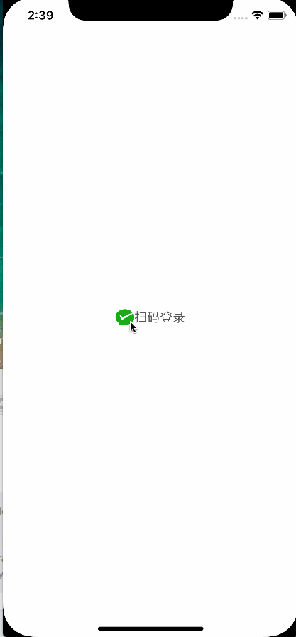

# wechatScanCodeLogin
ios 客户端微信扫码登录app

功能概述

扫码登录能力，指的是开发者可在移动应用内使用此能力，拉取二维码，用户使用微信客户端扫描二维码后可以登录此移动应用。此能力可被应用在多设备登录、智能硬件、电视盒子等场景。




iOS扫码授权获得Code流程

步骤一：请求函数

``#import <WechatAuthSDK.h>``
```
/*! @brief 发送登录请求，等待WechatAuthAPIDelegate回调
*
* @param appId 微信开发者ID
* @param nonceStr 一个随机的尽量不重复的字符串，用来使得每次的signature不同
* @param timeStamp 时间戳
* @param scope 应用授权作用域，拥有多个作用域用逗号（,）分隔
* @param signature 签名
* @param schemeData 会在扫码后拼在scheme后
* @return 成功返回YES，失败返回NO
注:该实现只保证同时只有一个Auth在运行，Auth未完成或未Stop再次调用Auth接口时会返回NO。
*/

- (BOOL)Auth:(NSString *)appId
nonceStr:(NSString *)nonceStr
timeStamp:(NSString*)timeStamp
scope:(NSString *)scope
signature:(NSString *)signature
schemeData:(NSString *)schemeData;

```

步骤二：监听二维码回调，回调的时候显示二维码

```
- (void)onAuthGotQrcode:(UIImage *)image;  //得到二维码
```

步骤三：用户确认登录之后回调authCode


```
- (void)onAuthFinish:(int)errCode AuthCode:(NSString *)authCode;    //成功登录
```

步骤四：使用authCode获取 ``access_token``,``unionid``,``openid``

```
https://api.weixin.qq.com/sns/oauth2/access_token?appid=APPID&secret=SECRET&code=CODE&grant_type=authorization_code
```

参数说明.


|参数|是否必须|说明|
| :-: | :-: | - |
| appid | 是 |应用唯一标识，在微信开放平台提交应用审核通过后获得|
| secret | 是 |应用密钥AppSecret，在微信开放平台提交应用审核通过后获得|
| code | 是 |填写第三步获取的authCode参数|
| grant_type | 是 |填authorization_code|


返回说明

```
正确的返回：
{
"access_token":"ACCESS_TOKEN",
"expires_in":7200,
"refresh_token":"REFRESH_TOKEN",
"openid":"OPENID",
"scope":"SCOPE",
"unionid":"o6_bmasdasdsad6_2sgVt7hMZOPfL"
}
```
